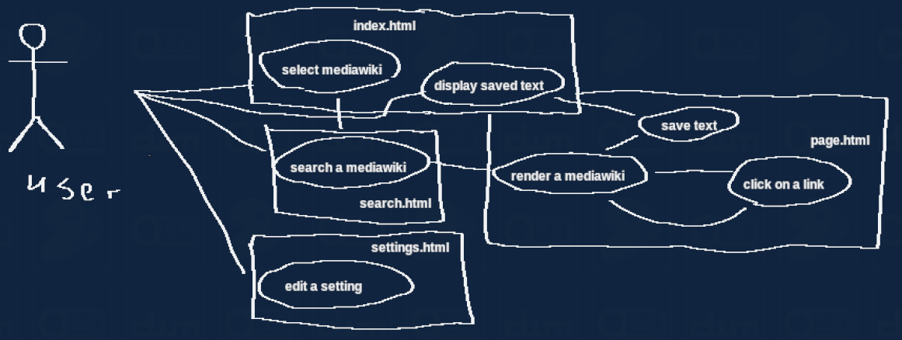

endpointy: /api.php

1. uživatel zadá wikistránky do vstupního pole v pravém horním rohu a zmáčkne 'Enter', wikistránky se změní.
2. uživatel zadá vyhledávaný pojem a zmáčkne 'Enter'.
3. z API se nejdříve načte seznam článků, potom se ke každému článku asynchroně načte krátký popis, dlouhý popis a obrázek
4. uživatel klikne na odpovídající odkaz ze seznamu
5. a API se načte HTML stránka, s obsahem
6. vymění se odkazy, odkazující na setejné wikistránky
7. načte se styl stránky
8. uživatel má možnost předčíst si stránku
9. uživatel má možnost vybrat text a zmáčknout 'CTRL + Q', pro uložení do seznamu, který lze zobrazit v 'index.html'

účel: dát možnost ke stylování wikipedie, a jiných mediawiki stránek, pro lepší čitělnost, vzhled, atd.
